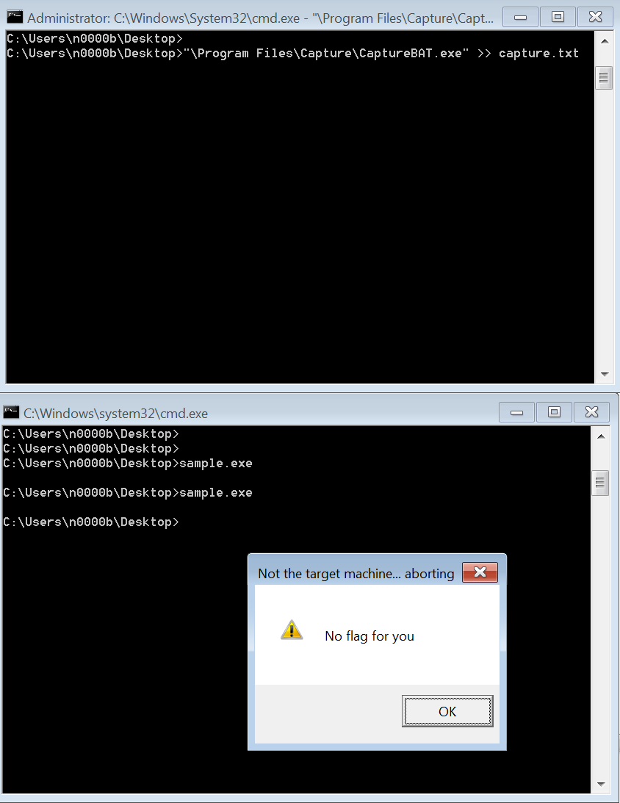
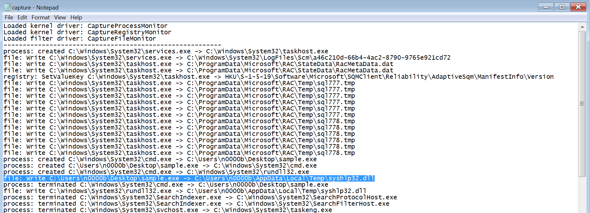
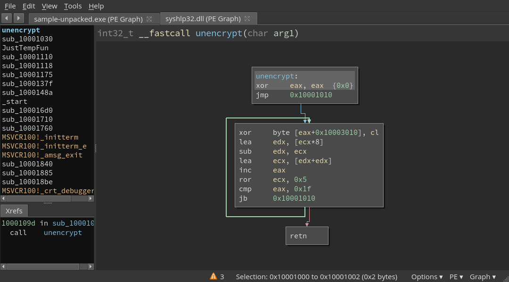
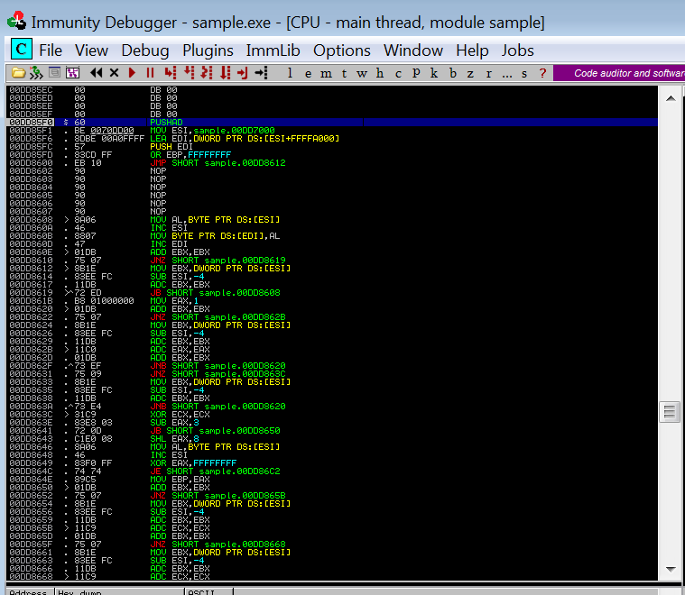
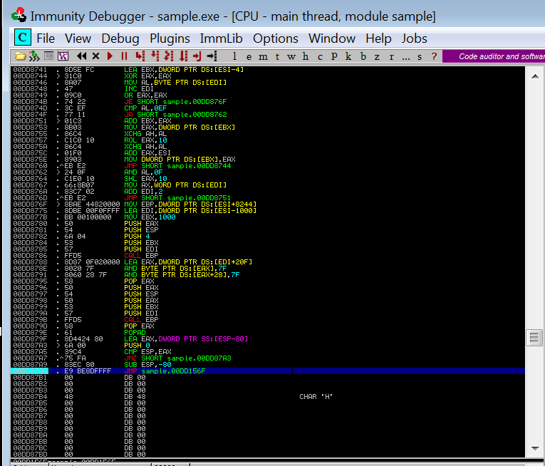
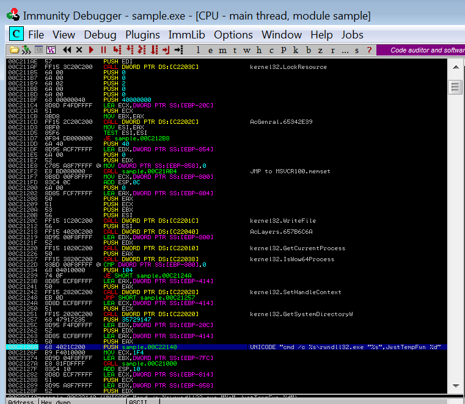

Fetch the binary...

```
$ file sample.exe
sample.exe: PE32 executable (console) Intel 80386, for MS Windows, UPX compressed
```

Upx encoding.  Easy, first we need to unpack it.

```
$ sudo apt-get install upx-ucl icoutils
...
$ upx -d -o sample-unpacked.exe sample.exe
                       Ultimate Packer for eXecutables
                          Copyright (C) 1996 - 2013
UPX 3.91        Markus Oberhumer, Laszlo Molnar & John Reiser   Sep 30th 2013

        File size         Ratio      Format      Name
   --------------------   ------   -----------   -----------
     14336 <-      8192   57.14%    win32/pe     sample-unpacked.exe

Unpacked 1 file.
$ ls -l sample*
-rw-r--r-- 1 jason jason  8192 Oct 17 17:19 sample.exe
-rw-r--r-- 1 jason jason 14336 Oct 17 17:19 sample-unpacked.exe
```
malware drops a DLL file in your temporary directoy (e.g. C:\WINDOWS\TEMP)
called `syshlp32.dll` (`sub_401110`).
The DLL is a payload inside of the exe file,
but we can extract it as follows (it's resource ID 0x67, 103 and
resource type 0xa, 10)

```
$ wrestool -l sample-unpacked.exe 
--type=10 --name=103 --language=1033 [type=rcdata offset=0x40a0 size=6656]
--type=24 --name=1 --language=1033 [offset=0x5aa0 size=346]
$ wrestool -x -n 103 --raw -o syshdlp32.dll sample-unpacked.exe 
$ file syshdlp32.dll
syshdlp32.dll: PE32 executable (DLL) (console) Intel 80386, for MS Windows
```

The other option is to use dynamic analysis with a tool like Capture-BAT installed
to windows. The original source is gone but at the time of this write-up you can get it from:
https://www.honeynet.org/node/315

Then we pull up a priviledged command prompt and run Capture-BAT redirecting output to
a file so we can search it easier if we desire:

```
C:\Users\n0000b\Desktop>"\Program Files\Capture\CaptureBAT.exe" >> capture.txt
```

Then in a second unpriviledged command prompt we run our malware:

```
C:\Users\n0000b\Desktop>sample.exe
```
Running it and resultant output example:




After running it we can search the log file for the file written and find it dropped our DLL into
our local temp file so we can just grab it there and start disassembling it:



After dropping the DLL, the EXE calls it by creating the commandline
from the template:

```
cmd /c %s\rundll32.exe "%s",JustTempFun %d
```

In otherwords, load a DLL and call its `JumpTempFun` function with
a string representation of an integer as its first (and only) argument.
The function at 0x401000 builds the command line by calling
`vsnwprintf`.  We need to know what the `%d` is (you'll see).

```
vsnwprintf(buffer, buffer_size, format_string, "C:\WINDOWS\SYSTEM32",
  "%TMPDIR%\syshlp32.dll", NUMBER);
```

NUMBER is pushed onto the stack before the command line creation
function is called with:

```
push 0x35729147
```

Back in the DLL, the JustTempFun(str) function calls atoi(str) and
uses the resulting integer as a seed to an decryption routine
(found at 0x10001000 in the DLL).





Which references the bytes highlighted below.


The loop there is equivalent to the code below.
Note: the value 0x35729147 used in the program.
The decrypt routine is, I believe, an [LFSR](https://en.wikipedia.org/wiki/Linear-feedback_shift_register).


```c
#include <stdio.h>
#include <string.h>
#include <stdint.h>

void
unencrypt(unsigned int ecx) {
	const uint8_t input[32] = {
		0x0f, 0xee, 0xad, 0x61, 0xd0, 0x21, 0xca, 0xf8,
		0x93, 0x14, 0x38, 0x32, 0xa6, 0xc9, 0x51, 0x7d,
		0xe8, 0x15, 0x22, 0xd2, 0xfc, 0x91, 0xf9, 0x78,
		0x5f, 0x60, 0xfb, 0xe4, 0xdc, 0x0c, 0x00, 0x00
	};
	uint8_t output[sizeof(input)];
	unsigned int i, edx;

	memset(output, 0, sizeof(output));
	for (i = 0; i < sizeof(input)-1; i++) {
		output[i] = input[i] ^ (ecx & 0xff);
		edx = ecx * 8;
		edx = edx - ecx;
		ecx = edx * 2;

		ecx = (ecx >> 5) | ((ecx & 0x1f) << 27);
	}
	printf("%s\n", output);
}

int
main() {
	unencrypt(0x35729147);
	return (0);
}
```

Another way to get here is to dynamically analyze it with OllyDbg or Immunity Debugger.
We open it and let it break automatically and see that there is very few instructions our debugger
can disassemble, and at the tail end it jumps to a segment that doesn't currently disassemble.




This is a sign of a packed executable (we can do this without unpacking if we desire) so we set
a break point on the jump and let it run to our break.



This unpacks the rest of the binary in memory
and we can just single step into the jump. At this point we can find our string calling our known
function into the DLL and set a break point on it.



After we run to that point we can find our value on the stack to decrypt with:


Now we see on the stack our third argument is our hex value to use:
0x35729147

# Credits

This writeup brought to you by Jason L. Wright (jason@thought.net, @risenrigel).
Props to @Spectre_03 for the dynamic analysis-fu, teaching me how to extract
the unpacked binary and DLL, and working with me on the static analysis.
