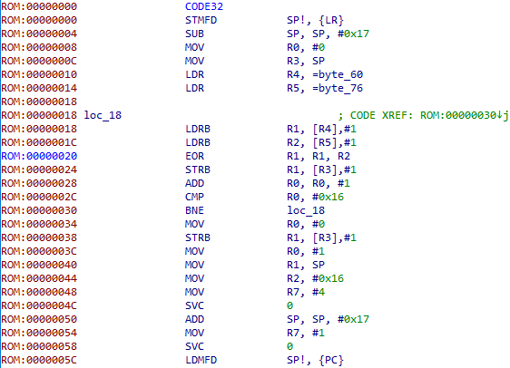

# Title

Binary Carapace

# hint

Figuring out what it is is fun.

[puzzle](puzzle)

# solution

What is it? a raw binary for ARM32, little endian. How did I know? (Bicep = ARM).
I just told IDA to open the file as 32bit Little Endian ARM
starting at address 0 and ended up with the disassembly show below.



If you decode it as big endian arm, the assembly just doesn't look right. We know we're on the right track with
little endian in part because the first instruction is commonly part of a function preamble (allocating 0x17 bytes of stack).

Ok, so looking at the disassembly, R4 gets a pointer to location "60" and R5 gets a pointer to location "76".
loc_18 is referred to by a loop (offset 30). So, it looks like we have a loop and the code looks something like:

```c
int r0 = 0;
char *r4 = &byte60, *r5 = &byte76;
char r13[0x17];

for (r0 = 0; r0 < 0x16; r0++) {
    // magic happens
}
```

Now, what magic happens?

```
    {
        char r1, r2;
        r1 = r4[r0];
        r2 = r5[r0];
        r1 = r1 ^ r2;
        r13[r0] = r1;
    }
```

In otherwords, all this code does is XOR the string starting at 0x60 with the string starting at 0x76 and store the result on the stack. As it turns out, this XOR'd string is our key.

```
char byte60[] = {;
    0x84, 0xA0, 0xFA, 0x51, 0x4B, 0x71, 0x17, 0x8D, 0x81, 0x39, 0x18,
    0xF6, 0x25, 0x12, 0x58, 0xB4, 0xA5, 0x3E, 0x94, 0xFC, 0x0D, 0xD0,
};
char byte76[] = {
    0xD4, 0xC5, 0x9B, 0x32, 0x24, 0x12, 0x7C, 0xCF, 0xE0, 0x55, 0x74, 
    0x84, 0x4A, 0x7D, 0x35, 0xE3, 0xD7, 0x5B, 0xFA, 0x9F, 0x65, 0xD0, 
};

int r0 = 0;
char *r4 = &byte60, *r5 = &byte76;
char r13[0x17];

memset(r13, 0, sizeof(r13));
for (r0 = 0; r0 < 0x16; r0++) {
        char r1, r2;
        r1 = r4[r0];
        r2 = r5[r0];
        r1 = r1 ^ r2;
        r13[r0] = r1;
}
printf("%s\n", r13);
```

# Author

[jason@thought.net](mailto:jason@thought.net), [@risenrigel](https://twitter.com/risenrigel)
